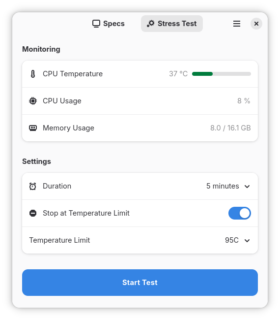
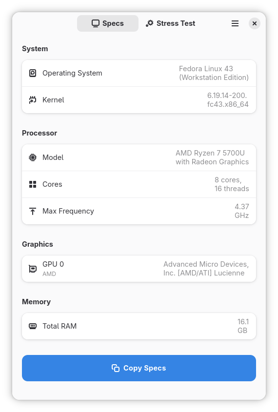

  

<h1 align="center">Crucible</h1>

  View specs and stress test hardware
    
  
  

## Features

- Easy to use: view your hardware specs and run stress tests without complex tools or configuration.
- Real-time monitoring: watch CPU temperature and usage live during stress tests.
- Safety built-in: automatic temperature cutoff prevents hardware damage during intensive testing.
- Share specs easily: copy a hardware report to share with others.
- All in the app: specs, stress testing, and live monitoring in one place.

## Run Crucible

## Development

You can clone this project and run it using [GNOME Builder](https://apps.gnome.org/Builder/).

## Screenshots

	

- **Stress Test**: run stress tests and monitor temperature and usage in real time.

	

- **Specs**: complete hardware overview with CPU, GPU, memory, and OS details.

## License

GPL-3.0-or-later
